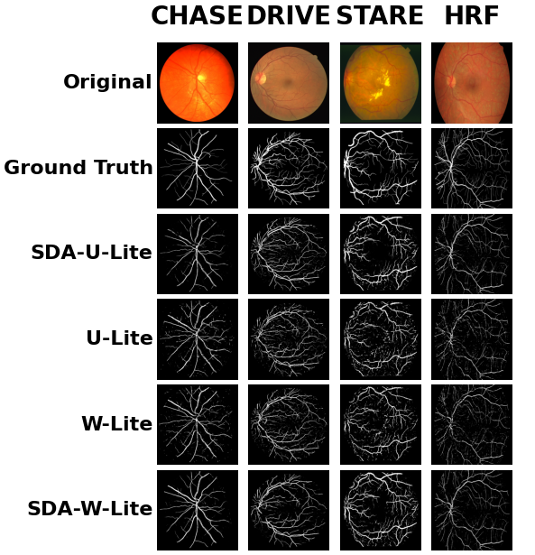
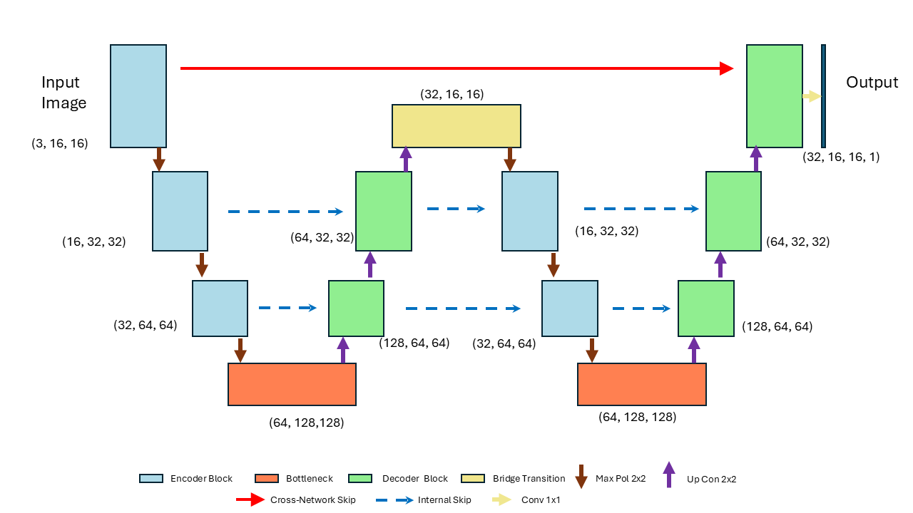

# Retinal Vessel Segmentation Benchmark

A modular system for training and comparing U-Net/U-Lite variants on CHASE, DRIVE, STARE, and HRF datasets.

## 📁 Repository Structure

```
SA-U-Lite_retinal_vessel_segmentation/
├── benchmark.py                # Interactive benchmarking runner
├── run_benchmark.py            # CLI for batch benchmarking
├── plot_result.py              # CLI for visualizing quantitative results (curves/metrics)
├── inference_plot.py           # CLI for qualitative segmentation comparison grid
├── config.py                   # Datasets, model registry, training config
├── data_loader.py              # Dataset loading utilities
├── losses.py                   # Loss functions
├── metrics.py                  # Evaluation metrics
├── trainer.py                  # Training loop and logging
├── models/                     # Model implementations
│   ├── saulite.py
│   ├── ... (other models)
│   └── w_net.py
└── results/                    # Auto-generated experiment outputs
```

## 🚀 Quick Start

### Interactive Training

Run the interactive benchmarking script:

```powershell
python .\benchmark.py
```

You will be prompted to choose dataset(s), model(s), and epochs.

### Command-Line Benchmark (CLI)

Use `run_benchmark.py` to run experiments directly from the terminal:

```powershell
# Basic run
python .\run_benchmark.py --dataset CHASE --models SA-U-Lite --epochs 50

# Multiple models across datasets
python .\run_benchmark.py -d DRIVE -m SA-U-Lite,W-Lite,SDA-U-Lite -e 25

# List options
python .\run_benchmark.py --list-datasets
python .\run_benchmark.py --list-models
```

### Results Visualization (Quantitative)

Use `plot_result.py` to visualize training curves (loss/dice) and performance metrics bar charts:

```powershell
# Interactive mode
python .\plot_result.py

# Plot specific dataset/epoch
python .\plot_result.py --dataset CHASE --epochs 50_epochs
```

### Qualitative Comparison (Inference Grid)

Use `inference_plot.py` to generate a high-resolution visual grid comparing actual segmentation outputs. The tool creates a matrix where **Columns represent Datasets** and **Rows represent Models**, including the Original Image and Ground Truth for reference.

**Usage:**

```powershell
# Compare SA-U-Lite and U-Lite models on CHASE and DRIVE datasets (using 50 epoch weights)
python .\inference_plot.py --datasets CHASE,DRIVE --models SA-U-Lite,U-Lite --epoch 50

# Compare a single model across all four datasets
python .\inference_plot.py -d CHASE,DRIVE,STARE,HRF -m W-Net -e 25
```

**Outputs:**
Saves a high-resolution PNG file (e.g., `comparison_grid_50ep.png`) in the root directory displaying the segmentation masks.

Exemple of the output :

<p align="center">
  
</p>


## 📊 Available Models

This benchmark includes various U-Net derivatives focusing on lightweight and attention-based mechanisms.

  - **SA-U-Lite**: U-Lite with spatial attention
  - **SDA-U-Lite**: Spatial attention + DropBlock
  - **U-Lite** / **UNet18**: Lightweight base models
  - **W-Lite** / **W-Net**: Cascaded W-shaped variants

### W-Net Architecture

<p align="center">
  
</p>

W-Net consists of two cascaded U-shaped networks. The first U-Net acts as a coarse segmenter, passing feature maps to the second U-Net for refinement. It utilizes standard internal skip connections within each block, alongside a long "Cross-Network Skip" connection that directly links the input image features to the final output block of the second network to preserve spatial details.

## 📁 Results Layout

After training, results are organized as:

```
results/
└── <DATASET>/
    └── <EPOCHS>/              # e.g., 100_epochs
        ├── models/            # best_<Model>.pth (Full Checkpoint)
        ├── train_hist/        # CSV + JSON summaries
        ├── performance.csv    # Tabular comparison across models
        └── performance.json   # Same metrics in JSON
```

## ⚙️ Configuration

Edit `config.py` to manage datasets paths, register new model architectures in `MODEL_REGISTRY`, or tune `TRAINING_CONFIG` (batch size, learning rate, etc.).

-----

Happy Benchmarking\! 🚀